# ATSAMA5D3-XPLD-ND
Bring up Linux kernel 5.0 on ATSAMA5D3-XPLD-ND

## Board Connections

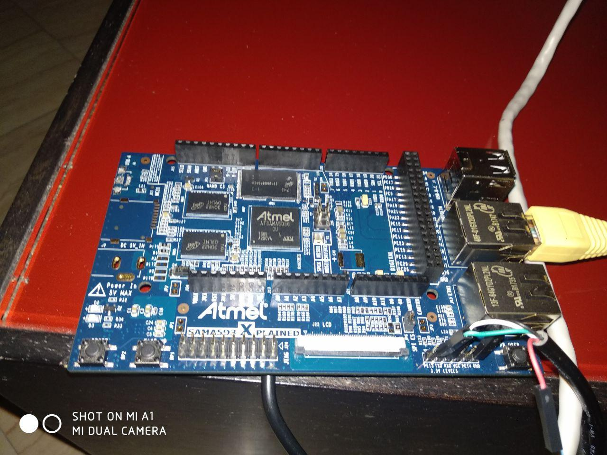

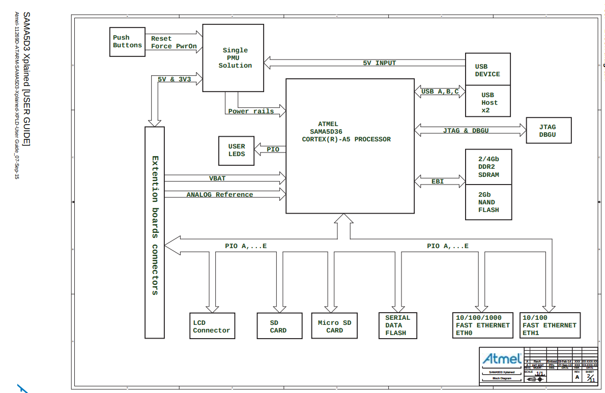

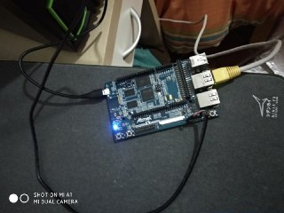

## Booting Phase (Bootstrap - U-Boot)

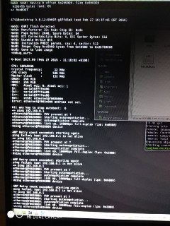

# Board Datasheet

## Memory Mapping ATSAMA5D3-XPLAINED

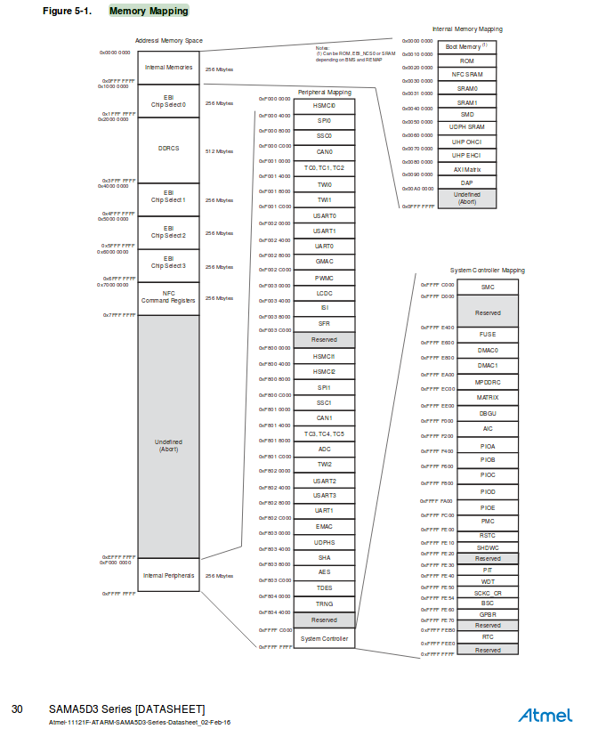

# GUIDE

##LS COMMAND
export PATH=/usr/bin:/bin

## GUIDE AND SLIDES

https://bootlin.com/doc/training/linux-kernel/
wget https://bootlin.com/doc/training/embedded-linux/embedded-linux-labs.tar.xz

## NEEDED PACKAGES

sudo apt install build-essential git autoconf bison flex texinfo help2man gawk libtool-bin libncurses5-dev

###CROSSTOOL-NG
git clone https://github.com/crosstool-ng/crosstool-ng.git

# INSTALL-CROSSTOOL-NG

./bootstrap
./configure --enable-local
make

./ct-ng help [help]

## CONFIGURE TOOLCHAIN TO PRODUCE MANY TOOLCHAIN FOR DIFFERENT ARCHITECTURE

./ct-ng arm-cortexa5-linux-uclibcgnueabihf
./ct-ng menuconfig

## SET OPTIONS
Path and misc options: --> Change Maximum log level to see to DEBUG
Toolchain options: --> Set Tuple's alias to "arm-linux"
C-library: --> Enable IPv6 support
Debug facilities: --> Only enable strace support

### SETTING PATH ENV VARIABLE
export  PATH=$HOME/x-tools/arm-cortexa5-linux-uclibcgnueabihf/bin/

###CLEAN
./ct-ng clean

###TO COMPILE
arm-linux-gcc hello.c

###DOWNLOAD MICROCHIP FLASHING-TOOL [sam-ba]
wget http://ww1.microchip.com/downloads/en/DeviceDoc/sam-ba_2.15.zip

## SETTING UP SERIAL COMMUNICATION WITH THE BOARD
install picocom --> sudo apt install picocom
sudo adduser $USER dialout
picocom -b 115200 /dev/ttyUSB0

#  AT91BOOTSTRAP SETUP BOOTSTRAP IN SRAM THAT INITIALIZE DRAM WITH U-BOOT INSIDE THAT LOAD THE LINUX KERNEL

git clone https://github.com/linux4sam/at91bootstrap.git

cd at91bootstrap

git checkout v3.8.9

### BUILD THE TOOLCHAIN

./ct-ng build  (BUILT IN  $HOME/x-tools/)

make sama5d3_xplainednf_uboot_defconfig

#SET ENVIRONMENT VARIABLE
export CROSS_COMPILE=arm-linux

#  AT91Bootstrap SETUP

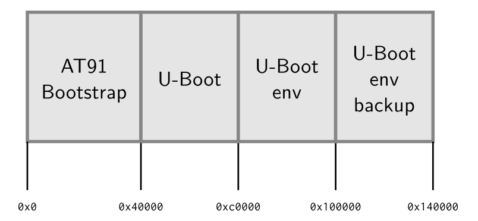

remove the NAND CS jumper on the board

press the RESET button

Put the jumper back

running samba64 

./sam-ba_64 in his folder

Select the ttyACM0 connection, and the at91sama5d3x-xplained board. Hit Connect.

Hit the NANDFlash tab

In the Scripts choices, select Enable NandFlash and hit Execute

Select Erase All, and execute the command

Then, select and execute Enable OS PMECC parameters in order to change the NAND ECC
parameters to what RomBOOT expects.

Finally, send the image we just compiled using the command Send Boot File

keep sam-ba open!!!!

#  U-BOOT SETUP [Shrinking]

download u-boot-->wget ftp://ftp.denx.de/pub/u-boot/u-boot-2017.09.tar.bz2 

make <NAME>_defconfig   NAME = sama5d3_xplained_nandflash

sudo apt install device-tree-compiler

make that build u-boot

Look at the size of the u-boot.bin --> ls -l <FILE-NAME> --> too large

make menuconfig, look for and disable the below options

ext4 options

• nfs options

• USB options

• SPL options

• XIMG support

• FIT (Flattened Image Tree) support

• CMD_ELF option

• dhcp command support

• Regular expression support (REGEX)

• loadb support

• CMD_MII option

recompile --> make

# FLASHING U-BOOT

In sam-ba, in the Send File Name field, set the path to the u-boot.bin that was just
compiled, and set the address to 0x40000. Click on the Send File button.

###TESTING U-BOOT AND AT91Bootstrap
Reset the board and check that it boots your new bootloaders

--->help to see u-boot commands

# Setting up Ethernet communication (Using tftp)

sudo apt-get install tftp

https://www.poftut.com/install-configure-run-linux-tftp-client/
http://wiki.r1soft.com/display/ServerBackupManager/Configure+a+TFTP+server+on+Linux
https://www.linuxquestions.org/questions/linux-embedded-and-single-board-computer-78/tftp-retry-count-exceeds-4175430611/

->folder-> /var/lib/tftpboot/ -> Create file.txt

sudo apt-get install xinetd

->folder ->create  /etc/xinetd.d/tftp

To set up create tftp file and write:

service tftp
{
protocol = udp
port = 69
socket_type = dgram
wait = yes
user = nobody
server = /usr/sbin/in.tftpd
server_args = -s /var/lib/tftpboot [FOR CHANGE THE DEFAULT TFTP FOLDER]
disable = no
}

$ifconfig -a

->enp0s31f6 Link encap:Ethernet  HWaddr 70:85:c2:57:82:ae  
          UP BROADCAST MULTICAST  MTU:1500  Metric:1
          RX packets:0 errors:0 dropped:0 overruns:0 frame:0
          TX packets:49 errors:0 dropped:0 overruns:0 carrier:0
          collisions:0 txqueuelen:1000 
          RX bytes:0 (0.0 B)  TX bytes:6175 (6.1 KB)
          Interrupt:16 Memory:df100000-df120000 

Configuring the host(My PC) IP address from command line (ip address = 192.168.0.1).

$nmcli con add type ethernet ifname enp0s31f6 ip4 192.168.0.1/24

Configure the network on the board in U-Boot by setting the ipaddr and serverip envi-ronment variables:

setenv ipaddr 192.168.0.100 (Target IP)
setenv serverip 192.168.0.1 (My PC/Host IP)

set the MAC address in U-boot:

setenv ethaddr 12:34:56:ab:cd:ef (Target Mac address)

saveenv

reset

To check if all working try to ping the Host(Server) from uBoot:

ping 192.168.0.1

and try to write prova.txt with something inside using :

tftp 0x22000000 textfile.txt

The tftp command should have downloaded the textfile.txt file from your development workstation into the board’s memory at location 0x22000000.

Verify with:

md 0x22000000

############################ ETHERNET ISSUES ###########################
setting up tftp server (https://docs.khadas.com/vim1/SetupTFTPServer.html)

sudo apt-get install openbsd-inetd tftpd tft

apt-get install inetutils-inetd

sudo apt-get update -y

sudo apt-get install -y xinetd

To enable the TFTP server, edit the file /etc/inetd.conf as the root user, and locate the line that looks like the following:

#tftp   dgram   udp     wait    root    /usr/sbin/tcpd  /usr/sbin/in.tftpd
Uncomment this line, and add the option and value -s /srv/tftp to the end of this line:

tftp   dgram   udp   wait   root   /usr/sbin/tcpd  /usr/sbin/in.tftpd -s /srv/tftp
Create and modify permissions on the TFTP root directory:

$ sudo mkdir /srv/tftp
$ sudo chown -R $(whoami) /srv/tftp
Restart the TFTP Service:

$ sudo /etc/init.d/xinetd restart

# Get Kernel - Cross-compile Kernel

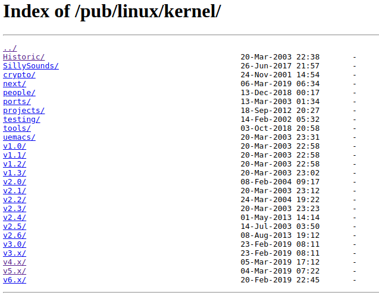

Download your kernel version https://mirrors.edge.kernel.org/pub/linux/kernel/

Go to the $HOME/embedded-linux-labs/kernel directory:

######################CORE-KERNEL-CHANGES##########################################################

arch/arm/mm/flush.c | 1 +

 1 file changed, 1 insertion(+)

diff --git a/arch/arm/mm/flush.c b/arch/arm/mm/flush.c

index 58469623b015..5345f86c56d2 100644

--- a/arch/arm/mm/flush.c

+++ b/arch/arm/mm/flush.c

@@ -295,6 +295,7 @@ void __sync_icache_dcache(pte_t pteval)

 	if (pte_exec(pteval))

 		__flush_icache_all();

 }

+EXPORT_SYMBOL_GPL(__sync_icache_dcache);

#endif

#################INSTRUCTIONS################################################################

export PATH="~/x-tools/arm-cortexa5-linux-uclibcgnueabihf/bin/":$PATH

export CROSS_COMPILE="arm-linux-"

export ARCH="arm"

make menuconfig

make -j[core numbers]

After build you can find the Kernel image (zImage) in:

arch/arm/boot/

# Compile Device Tree Source

linaro_guide_pdf -> ./device_tree_guide.pdf

tutorial -> http://junyelee.blogspot.com/2015/07/a-tutorial-on-device-tree.html?m=1

language -> https://elinux.org/Device_Tree_Usage

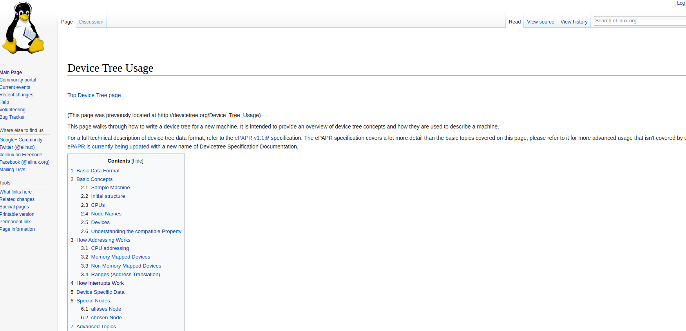

To compile .dts for our board ( at91-sama5d3_xplained.dts ) in his relative blob at91-sama5d3_xplained.dtb:

https://stackoverflow.com/questions/28502757/imx6-device-tree-compilation-fatal-error-unable-to-parse-input-tree

make ARCH=arm CROSS_COMPILE=arm-linux- sama5_defconfig [ Search in ---> arch/arm/configs your board ]

make

make ARCH=arm CROSS_COMPILE=arm-linux- dtbs

Compiled .dtb is in arch/arm/boot/dts folder

# Create Custom Device Tree Blob

###############################################################################################

HOW CREATE FIRST .dtb

Hi all,
After compiling your kernel, check this directory: /arch/arm/boot/dts copy these three files:

skeleton.dtsi

socfpga.dtsi

socfpga_cyclone5.dts

Now from the Embedded Command Shell, compile these files into a single .dtb file:

dtc -I dts -O dtb -o socfpga.dtb socfpga_cyclone5.dts

Copy the generated socfpga.dtb to your SD card and you should be able to boot kernel.

I tried this with kernel version 3.10-ltsi, and I think all kernel versions come with .dts files.

Note that you should edit .dts files according to the implemented hardware design. Usually, sopc2dts tool should do that but I have been struggling for a few days with this tool without getting any bootable .dtb file. Probably XML board files I am using are corrupted or incompatible with new kernels, and I could not find working copies for my board DE1-SoC.

##2----> https://forum.rocketboards.org/t/build-own-device-tree-and-linux-kernel/177/13

Read the Linaro guide in this Folder (4_6048767180722406692.pdf) or the following tutorial:

---> http://xillybus.com/tutorials/device-tree-zynq-1

---> https://www.youtube.com/watch?v=zkCbO4XhKx4&t=308s

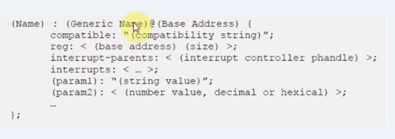
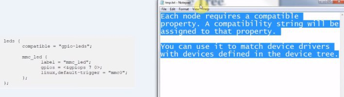
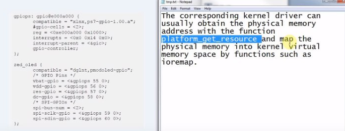
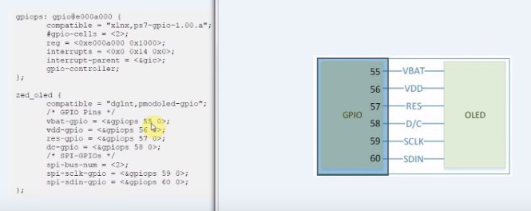
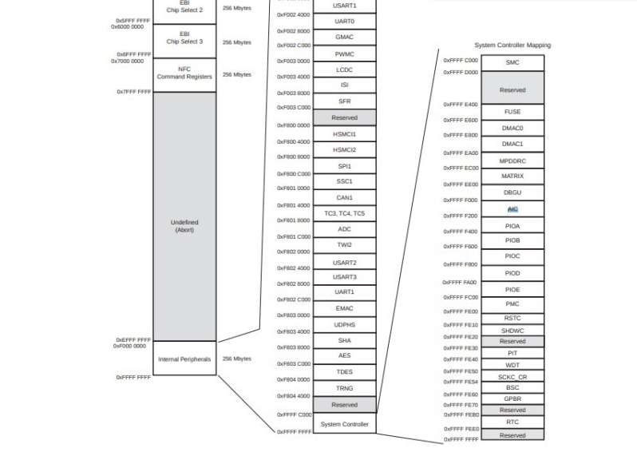
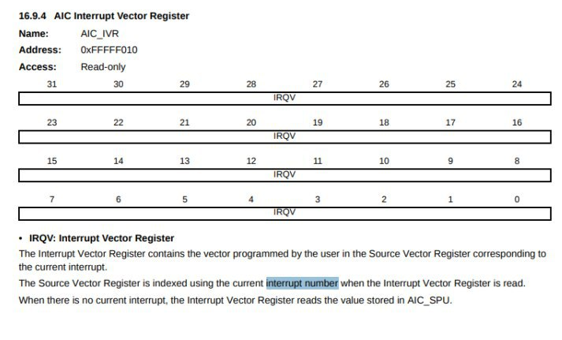

# Booting Kernel using U-Boot

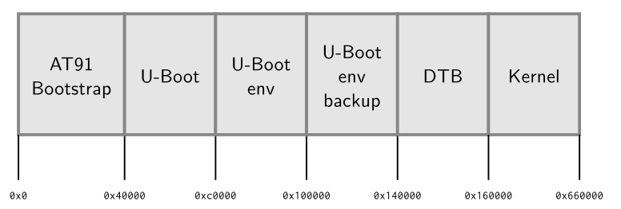

There are two ways to boot the kernel using U-Boot:

1. Using tftp connection, booting from tftp. From U-Boot:

Commands:

    * tftp 0x21000000 zImage
    * tftp 0x22000000 at91-sama5d3_xplained.dtb
    * bootz 0x21000000 - 0x22000000

Scripts in U-boot "bootcmd" variable:

    * setenv bootcmd 'tftp 0x21000000 zImage; tftp 0x22000000 at91-sama5d3_xplained.dtb;  bootz 0x21000000 - 0x22000000'
    * saveenv
    * press the board reset button to check

2. Booting Kernel image and .dtb from Nand flash.

From tftp server to RAM address:

    * tftp 0x21000000 zImage
    * tftp 0x22000000 at91-sama5d3_xplained.dtb

Erase the NAND flash memory:

    * nand erase 0x140000 0x20000
    * nand erase 0x160000 0x500000

Write from  RAM address to NAND flash memory address:

    * nand write 0x22000000 0x140000 0x20000
    * nand write 0x21000000 0x160000 0x500000

Read from NAND memory using RAM memory and booting the kernel:
    
    * nand read 0x22000000 0x140000 0x20000
    * nand read 0x21000000 0x160000 0x500000
    * bootz 0x21000000 - 0x22000000

Scripts in U-boot "bootcmd" variable:

    * setenv bootcmd 'nand read 0x22000000 0x140000 0x20000; nand read 0x21000000 0x160000 0x500000; bootz 0x21000000 - 0x22000000'
    * saveenv
    * press the board reset button to check

Save first script in another variable:

    * setenv bootcmdtftp ${bootcmd}

After we chose the type of booting procedure you need to automate it writing u-boot script that do that.
